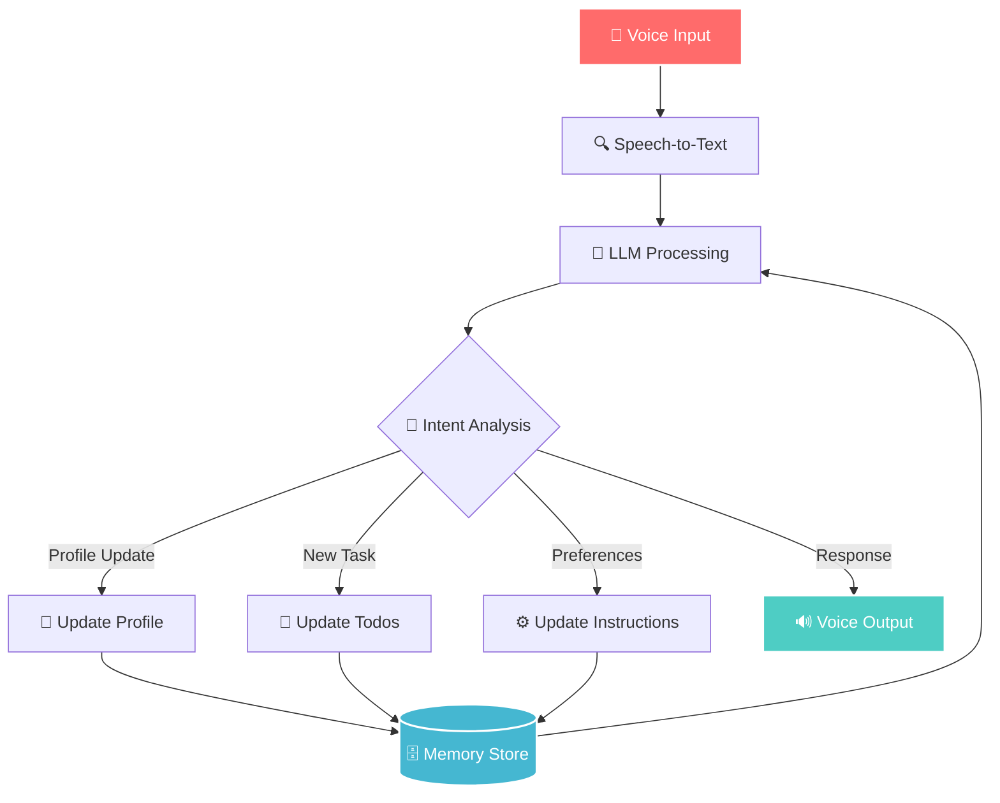
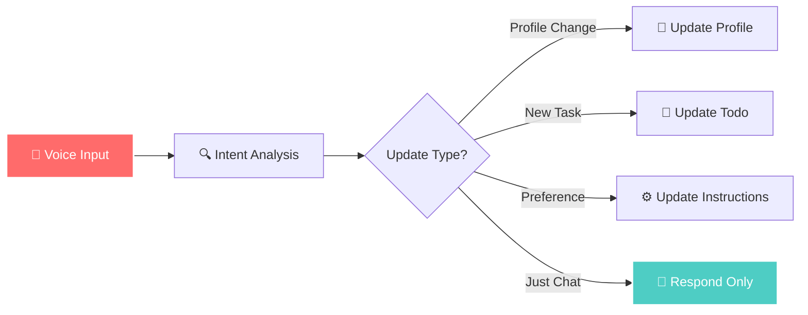

# 🎙️ Personal Task Voice Assistant

<div align="center">

[](https://github.com/langchain-ai/langgraph)
[](https://platform.openai.com/docs/guides/gpt)
[](LICENSE)
[](#)

**🎯 Your AI-powered personal assistant that transforms natural speech into organized action**

*Say goodbye to forgotten tasks and hello to intelligent voice-driven productivity*

---

### 🌟 **What makes this special?**

🎤 **Just speak naturally** → 🤖 **AI understands & organizes** → ✅ **Tasks get done**

</div>

---

## 🎬 **Experience the Magic**

```
👤 "Hey, can you help me organize my day? I need to read about MCP servers, 
    finish my NLP assignment, and call mom before dinner."

🤖 "Absolutely! I've organized your tasks by priority:
    
    📚 High Priority: NLP assignment (due soon)
    💻 Medium Priority: MCP servers research  
    📞 Personal: Call mom before dinner
    
    Would you like me to set reminders for any of these?"

✨ Your todo list is automatically updated with intelligent categorization!
```

---

## 🚀 **Why This Assistant is Revolutionary**

<table>
<tr>
<td width="50%" valign="top">

### 🧠 **Intelligent Memory System**
- **Remembers your preferences** across sessions
- **Learns from your patterns** to suggest better organization
- **Contextual understanding** of your personal workflow
- **Multi-category organization** (work, personal, projects)

### 🎯 **Natural Voice Processing**
- **Speak as you think** - no rigid commands needed
- **Multi-language support** for global users
- **Noise filtering** for clear transcription
- **Real-time processing** with instant feedback

</td>
<td width="50%" valign="top">

### 🔄 **Seamless Integration**
- **Auto-updates** your task memory in real-time
- **Smart categorization** based on context
- **Priority detection** from your speech patterns
- **Cross-platform compatibility** 

### 🛡️ **Privacy-First Design**
- **Local processing** where possible
- **Encrypted memory storage**
- **No data selling** - your tasks stay yours
- **Transparent AI reasoning**

</td>
</tr>
</table>

---

## 🎨 **Architecture That Just Works**

<div align="center">



</div>

---

## 📁 **Project Structure - Clean & Organized**

```
🏗️ TASK_MAISTRO/
├── 🔧 .langgraph_api/           # LangGraph development environment
├── 🤖 Assistant/                # Core AI assistant logic
│   ├── 💭 prompts/             # Carefully crafted prompt templates
│   └── 🛠️ utils/               # Powerful utility modules
│       ├── ⚙️ configuration.py  # User & category configuration
│       ├── 🔗 nodes.py         # LangGraph processing nodes
│       ├── 📋 schema.py        # Data structure definitions
│       ├── 🛠️ tools.py         # TrustCall integration tools
│       ├── 🎯 utils.py         # Helper functions & utilities
│       └── 📦 __init__.py      # Module initialization
├── 🎪 agent.py                 # Main application entry point
├── 🔧 langgraph.json           # LangGraph configuration
├── 📦 requirements.txt         # Python dependencies
├── 📄 LICENSE                  # MIT License
└── 📖 README.md               # This amazing documentation!
```

---

## ⚡ **Quick Start - Get Running in 3 Minutes**

### 🔥 **Option 1: One-Command Setup**

```bash
# Clone, install, and run with one command!
git clone https://github.com/your-username/Personal_Task_Voice_Assistant.git && \
cd Personal_Task_Voice_Assistant && \
pip install -r requirements.txt && \
echo "OPENAI_API_KEY=your-api-key-here" > .env && \
langgraph dev
```

### 🎯 **Option 2: Step-by-Step**

<details>
<summary>📋 <strong>Click to expand detailed setup</strong></summary>

#### 1️⃣ **Clone the Magic**
```bash
git clone https://github.com/your-username/Personal_Task_Voice_Assistant.git
cd Personal_Task_Voice_Assistant
```

#### 2️⃣ **Install Dependencies**
```bash
# Install all required packages
pip install -r requirements.txt

# Or if you prefer conda
conda env create -f environment.yml
conda activate task-assistant
```

#### 3️⃣ **Configure Your API**
Create a `.env` file:
```env
# Required
OPENAI_API_KEY=your-openai-api-key

# Optional: Customize your experience
USER_ID=your-unique-identifier
DEFAULT_CATEGORY=personal
VOICE_LANGUAGE=en-US
```

#### 4️⃣ **Launch & Enjoy**
```bash
langgraph dev
```

**🎉 That's it! Start speaking to your new AI assistant!**

</details>

---

## 🎭 **Real-World Use Cases**

<div align="center">

| 🏢 **Professional** | 🏠 **Personal** | 🎓 **Student** | 💼 **Entrepreneur** |
|---------------------|------------------|-----------------|---------------------|
| Meeting prep tasks | Grocery shopping | Assignment tracking | Investor pitch prep |
| Email follow-ups | Home maintenance | Study schedules | Product launch tasks |
| Project deadlines | Family events | Research notes | Team coordination |
| Client reminders | Health appointments | Group projects | Budget planning |

</div>

---

## 🎪 **Demo - See It In Action**

<details>
<summary>🎬 <strong>Click to see example conversations</strong></summary>

### 📞 **Scenario 1: Morning Planning**
```
👤 "Good morning! I have a busy day ahead. I need to prepare for my 
    presentation, buy groceries, and don't let me forget about my 
    dentist appointment at 3 PM."

🤖 "Good morning! I've organized your day:
    
    🎯 PRIORITY TASKS:
    📊 Presentation preparation (work)
    🛒 Grocery shopping (personal)
    🦷 Dentist appointment - 3 PM (health)
    
    I'll remind you about the dentist 30 minutes before. Would you 
    like me to suggest a presentation outline?"

✨ Profile updated with schedule preferences
✅ 3 tasks added with smart categorization
⏰ Automatic reminder set
```

### 🎯 **Scenario 2: Project Management**
```
👤 "I'm working on a machine learning project. I need to clean the 
    dataset, train three different models, and write up the results. 
    The deadline is Friday."

🤖 "Great! I've broken down your ML project:
    
    📊 ML PROJECT PIPELINE:
    1. 🧹 Data cleaning & preprocessing
    2. 🤖 Model training (3 algorithms)
    3. 📝 Results documentation
    
    ⏰ Deadline: Friday
    💡 Suggestion: Start with data cleaning - it often takes longer 
       than expected. Want me to set daily check-ins?"

✨ Project broken into logical subtasks
✅ Deadline tracking enabled
🎯 Intelligent workflow suggestions
```

### 🎨 **Scenario 3: Creative Project**
```
👤 "I want to start a blog about sustainable living. I need to research 
    topics, create a content calendar, and write my first three posts."

🤖 "Exciting project! Here's your blogging roadmap:
    
    📝 BLOG LAUNCH PLAN:
    🔍 Research trending sustainability topics
    📅 Create 3-month content calendar  
    ✍️ Write first 3 posts
    
    💡 I notice you're passionate about environment topics. Should I 
       prioritize zero-waste and renewable energy content?"

✨ Personal interests recognized
✅ Strategic project planning
🎯 Content suggestions based on profile
```

</details>

---

## 🧠 **Advanced Features**

### 🎯 **Intelligent Memory System**

<div align="center">

```python
# Your assistant remembers everything important
namespace = (type, category, user_id)

Memory Types:
🧑 "profile"     → Your preferences, work style, priorities
📝 "todo"        → Tasks, deadlines, project status  
⚙️ "instructions" → How you like your assistant to behave
```

</div>

### 🔄 **Smart Update Flow**



---

## 🛠️ **Built With Industry-Leading Tools**

<div align="center">

| Technology | Purpose | Why We Chose It |
|------------|---------|----------------|
| 🔗 **LangGraph** | AI workflow orchestration | Perfect for complex, multi-step AI processes |
| 🤖 **OpenAI GPT-4o** | Natural language understanding | Best-in-class language model for conversations |
| 🎯 **TrustCall Extractors** | Structured data extraction | Reliable extraction of tasks and preferences |
| 🎤 **SoundDevice** | Audio input capture | Cross-platform audio recording |
| 🔊 **Scipy.io.wavfile** | Audio file processing | Efficient audio format handling |
| 🐍 **Python 3.9+** | Core language | Robust ecosystem for AI development |

</div>


## 🤝 **Contributing - Join the Revolution**

<div align="center">

**🎉 We love contributors! Here's how to get involved:**

[](CONTRIBUTING.md)
[](https://github.com/your-username/Personal_Task_Voice_Assistant/issues)

</div>

### 🌟 **Ways to Contribute**

| 💻 **Code** | 📖 **Documentation** | 🐛 **Bug Reports** | 💡 **Ideas** |
|-------------|---------------------|-------------------|-------------|
| New features | Tutorials | Issue reports | Feature requests |
| Bug fixes | Code examples | Test cases | UI/UX improvements |
| Performance | Translations | Benchmarks | Workflow ideas |

### 🚀 **Getting Started**

<details>
<summary>📋 <strong>Contributor Quick Start</strong></summary>

```bash
# 1. Fork the repository
git fork https://github.com/your-username/Personal_Task_Voice_Assistant.git

# 2. Create a feature branch
git checkout -b amazing-new-feature

# 3. Set up development environment
pip install -r requirements-dev.txt
pre-commit install

# 4. Make your changes
# ... code, test, document ...


# 5. Submit a pull request
git push origin amazing-new-feature
```

</details>


## 📄 **License & Legal**

<div align="center">

**📜 MIT License - Freedom to Innovate**

This project is licensed under the MIT License - see the [LICENSE](LICENSE) file for details.

*Translation: Use it, modify it, share it, sell it - just give us credit!*

</div>

---

## 🙏 **Acknowledgments**

<div align="center">

**🌟 Standing on the Shoulders of Giants**

Special thanks to the amazing teams and individuals who made this possible:

🔗 **LangChain Team** - For creating the LangGraph framework  
🤖 **OpenAI** - For the incredible GPT-4o and Whisper APIs  
🎤 **Open Source Community** - For countless libraries and tools  
👥 **Beta Testers** - For feedback and bug reports  
🎨 **Design Inspiration** - Modern UI/UX principles  

</div>

---

<div align="center">

**🎯 Ready to transform your productivity?**

[](https://github.com/your-username/Personal_Task_Voice_Assistant)
[](https://github.com/your-username/Personal_Task_Voice_Assistant)

---

**Made with ❤️ by developers who believe in the power of voice-driven productivity**

*Don't just manage tasks - have conversations with your productivity*

</div>
